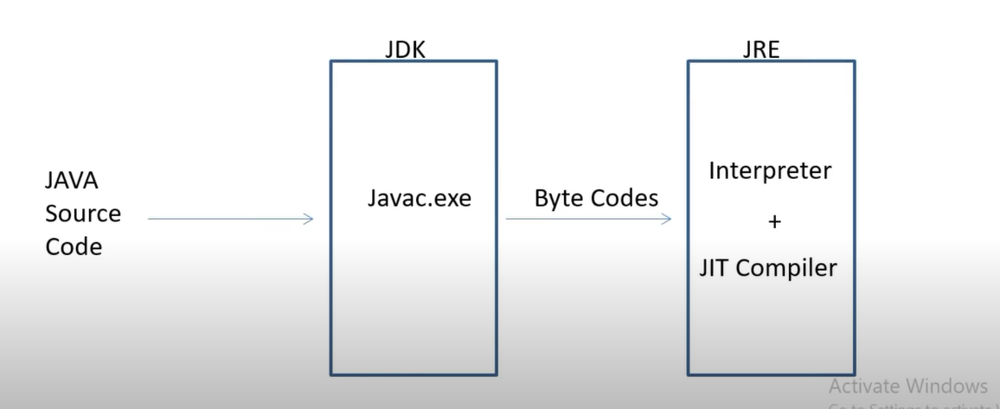

# Java Interview Questions & Answers

## Q1: Why Java is not 100% Object-oriented?

Java uses **primitive data types** (e.g., `int`, `char`, `boolean`, etc.), which are **not objects**.

Even though Java provides **wrapper classes** (e.g., `Integer`, `Character`, etc.), the presence of primitives means Java is not *fully* object-oriented.

---

## Q2: Why pointers are not used in Java?

- Pointers are **unsafe** and can lead to security vulnerabilities.
- They **increase complexity** of programs.
- Java promotes **simplicity**, and JVM handles **memory management** automatically, so manual pointer manipulation is unnecessary and discouraged.

---

## Q3: What is JIT Compiler in Java?

The **Just-In-Time (JIT)** compiler improves performance by compiling bytecode to native machine code at runtime. This reduces interpretation overhead.

**Diagram**:  


---

## Q4: Why is String immutable in Java?

1. **String Pooling** – Immutable strings can be reused safely.
2. **Security** – Used in sensitive areas like file paths, DB connections. Immutability ensures they can't be modified after creation.

---

## Q5: What is a Marker Interface?

A **Marker Interface** is an interface **without any methods or fields**. It provides **metadata** to the JVM or compiler.

**Examples**: `Serializable`, `Cloneable`

---

## Q6: Can you override a private or static method in Java?

- **Private methods** are not accessible in subclasses — you’re creating a *new* method, not overriding.
- **Static methods** can be re-declared in child classes, but this is called **method hiding**, not overriding.

---

## Q7: Does `finally` always execute?

Mostly yes, except in these cases:
- When `System.exit()` is called.
- In case of **fatal system errors/crash**.

---

## Q8: What methods does the `Object` class have?

`java.lang.Object` methods include:
- `clone()`
- `equals(Object obj)`
- `finalize()`
- `getClass()`
- `hashCode()`
- `toString()`

---

## Q9: How Can You Make a Class Immutable?

To make a class immutable in Java:

1. Declare the class as `final` so it cannot be extended.
2. Make all fields `private` to prevent direct access.
3. Do **not** provide any setter methods.
4. Make all **mutable** fields `final` so they can only be assigned once.
5. Initialize all fields using a constructor (preferably doing a deep copy).
6. In getter methods, return a **copy** of mutable objects instead of the original reference.

---

### ✅ Example: Immutable `Student` Class

```java
import java.util.Date;

public final class Student {
    private final String name;
    private final int age;
    private final Date dateOfBirth; // mutable object

    public Student(String name, int age, Date dateOfBirth) {
        this.name = name;
        this.age = age;
        // Deep copy of mutable object
        this.dateOfBirth = new Date(dateOfBirth.getTime());
    }

    public String getName() {
        return name;
    }

    public int getAge() {
        return age;
    }

    // Return a copy, not the original
    public Date getDateOfBirth() {
        return new Date(dateOfBirth.getTime());
    }
}


---

## Q10: What is a Singleton class in Java? How to create one?

A **Singleton class** allows only one instance to exist per JVM.

### Steps:
- Use a **private static instance**.
- Constructor should be **private**.
- Provide a **public static method** to return the instance.

**Code Example**:
```java
public class Animal {
    private static Animal single_instance = null;

    private Animal() {}

    public static Animal getInstance() {
        if (single_instance == null)
            single_instance = new Animal();
        return single_instance;
    }
}
